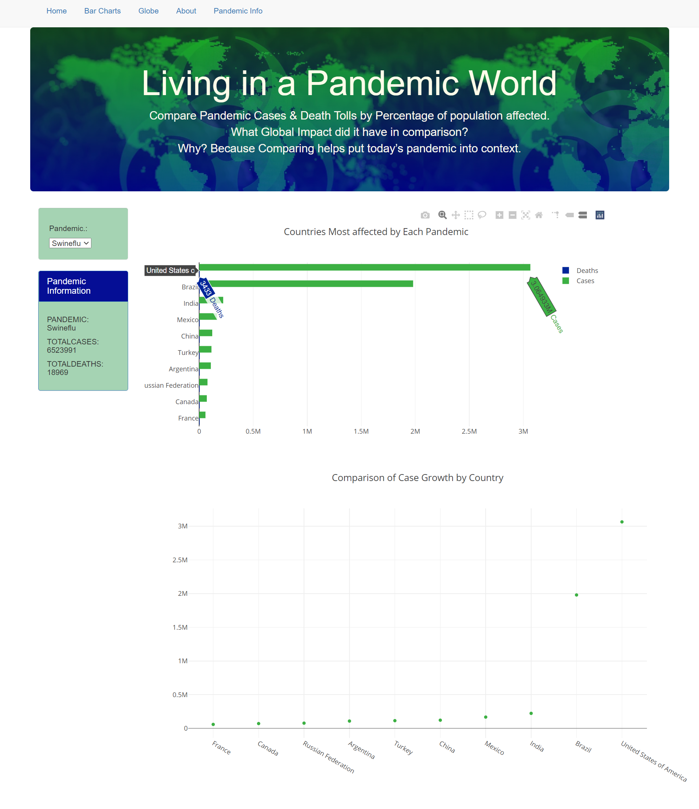
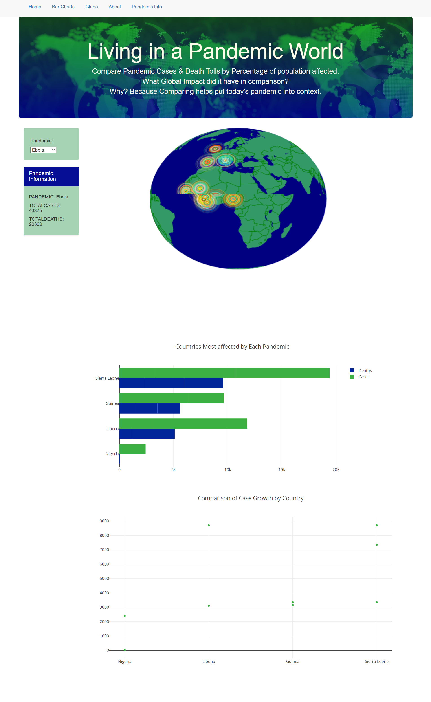
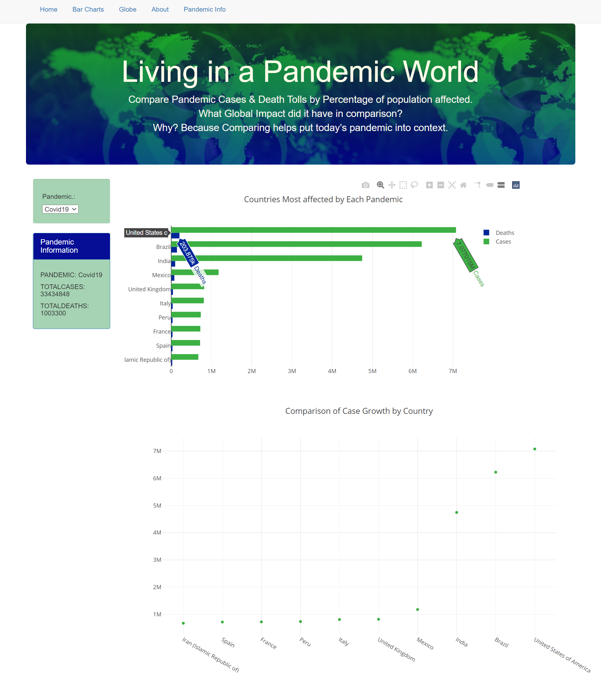
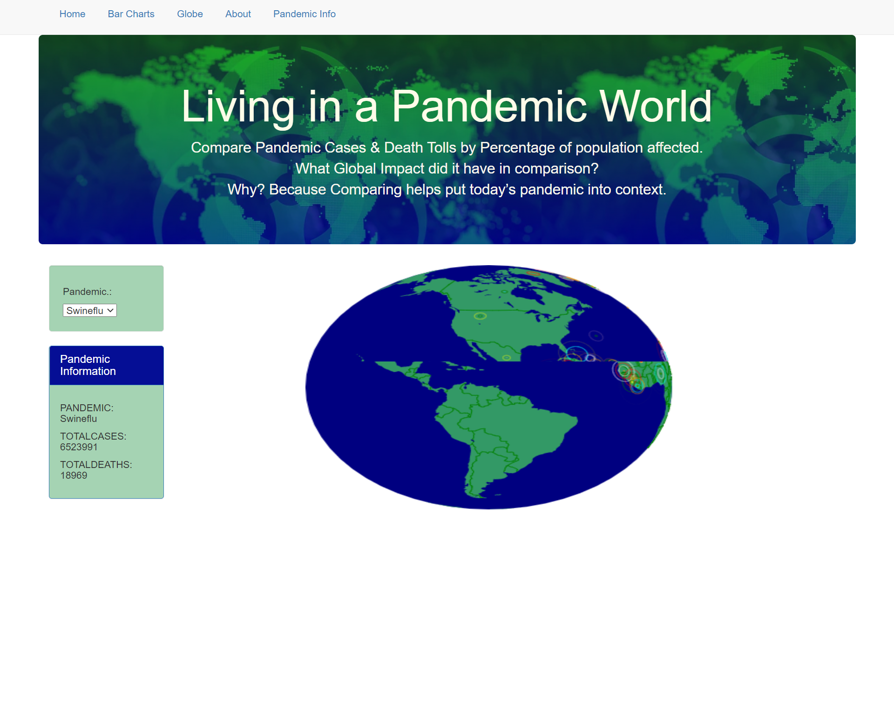
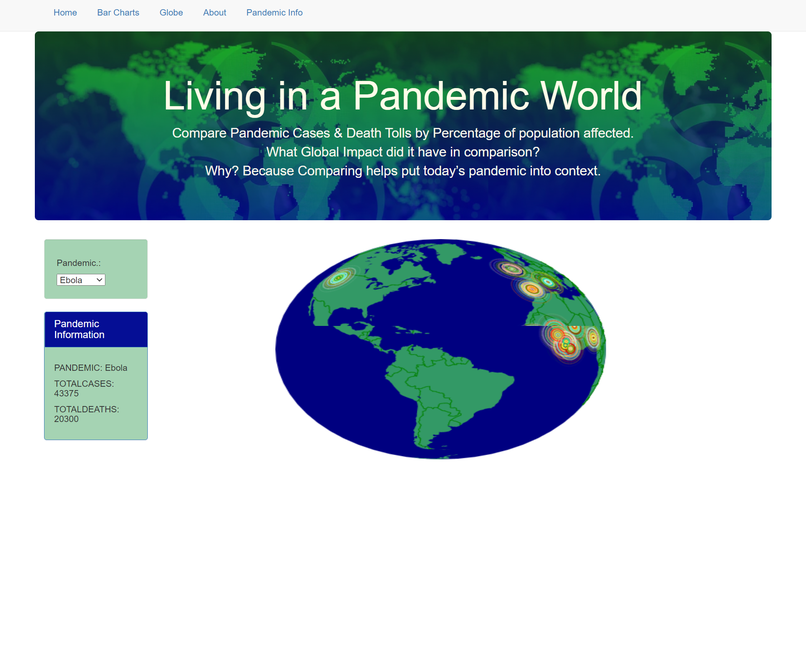
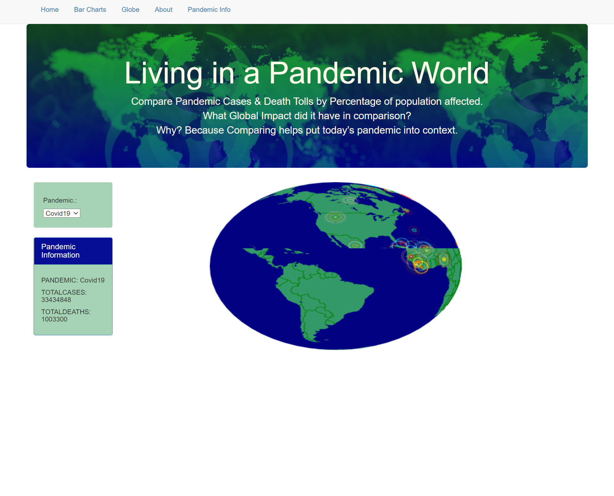

## ***Project Pandemic***
### By Molly Cox and Melissa Wright
#### (Forked from UC Berkeley Bootcamp Project 2:  Pandemics)
#### [With additional technical support from tutors Mark Steadman, Samael Reyna, and Earnest Long Jr.]
---
### ***Project Description:***
The COVID-19 Pandemic has swept the globe.  In the recent past, what was the magnitude of other pandemics?  We gathered data from the Swine Flu outbreak of 2009, the Ebola outbreak of 2014 and  COVID data is as of March 2020 and compared their case and death rates through bar charts and a globe with each country's proportional case rate.

### ***Instructions:***
1. Prerequisites:
    1.  All files listed above - download to a new subdirectory
    1. Flask (to create a web server to host your web page)
    1.  Python
    1.  Pandas       
    1. Jupyter Notebook (If you want to explore datasets)
    

2. Run the application:
    1. Go to a terminal application, such as git bash
    1. Go to the subdirectory containing the pandemic files 
    1. At the command line, run the flask application 
        ***python app.py***
    1. In the chrome browser, go to ***http://127.0.0.1:5000/***
        The Pandemic Dashboard appears
    1. Choose one of the 3 pandemics to view globe and bar chart visualizations.
    [Note:  the data for the globe is delayed approximately 1 earth rotation before going to the correct pandemic data]

### ***Steps taken to create the Website Dashboard:***
1. Use a Python Flask–powered RESTful API, HTML/CSS, JavaScript, and one database:  SQLite. 
1. Make a dashboard page with multiple charts that update from the same data : Globe, Bar, Line  
1. Use a JS library that we did not cover in class:  PlanetaryJS
1. Ensure Visualizations are powered by  data sets with at least 100 records. : Multiple Pandemics & Centroids for plotting 195 Countries 
1. User-driven interaction: dropdowns & Menu Bar to view about page / pandemic info / charts 
1. Final visualization includes: Globe, Bar Chart, and Line Chart


### ***Datasets***
1. Covid19:   https://www.kaggle.com/sudalairajkumar/novel-corona-virus-2019-dataset#covid_19_data.csv
1. Ebola 2014-16:  https://www.kaggle.com/imdevskp/ebola-outbreak-20142016-complete-dataset (we added possible, suspected to the confirmed deaths)
1. Swineflu 2009:  https://en.wikipedia.org/wiki/2009_flu_pandemic_by_country
1. Spanish Flu:  https://ourworldindata.org/spanish-flu-largest-influenza-pandemic-in-history  (for reference, not included in visualizations) 

### ***Datasets for Population & Plotting on Map***

1. United Nations:  https://population.un.org/wpp/Download/Standard/Population/
1. Centroids Data - https://worldmap.harvard.edu/data/geonode:country_centroids_az8 

### ***ETL PROCESS***

We used Jupyter Notebook to accomplish the following:
* Take the raw data and group by Country/Year. 
* Merge the dataset with United Nations populations data so we could compare the magnitude of the epidemic relative to country population.
* Merge this dataset with a dataset that contains a latitude and longitude for the center of each country so that we could plot the data on the globe.  
* To merge the files by country, we made a lookup table that had the country names for each data set.  
* Create a Jupyter Notebook for each Pandemic and then had it generate a clean CSV file. 
* Import the now clean csv files into a new notebook, combine them, and store the data in a sqlite database.

Jupyter Notebook Files:
* lastdate_covid_19_scrubbing
* ebola_scrub
* swineflu_scrub_wikipedia
* pop_scrub
* combine_csvs

Scrubbed .CSV Files:
* merged_covid_19_data
* swineflu_data
* ebola_data

* pop_data
* clean_country_centroids_az8 (centroid data)
* Country_lookup_table

Database File:
* pandemic_final.db (sqlite database)


---
#### PANDEMIC WEBSITE - VISUALIZATIONS
(Note: top row is a MENU BAR to access bar charts, globe, and history of pandemics  
(One of 3 pandemics must be chosen from the drop down list for globe and bar charts to display) 




These Change as you select the drop down 
#### MENU BAR TO ACCESS GLOBE 
** There is a delay when running these so we have taken a screenshot of the corresponding globe image

 
 
 

 ``````

 ### Challenges
 * Accuracy and availability of data: there is a lack of comprehensive data for pandemics prior to 1960 
 * Making the Flask/Database/Javascript connection:  Until we were able to do it ourselves, we didn't understand how to put all these pieces together.

 ### If we had more time...
 * Try to fix delay in epidemic data appearing on globe
 * Add more pandemics to list of visualizations for comparison
 * Clean up jupyter notebooks to be more efficient
